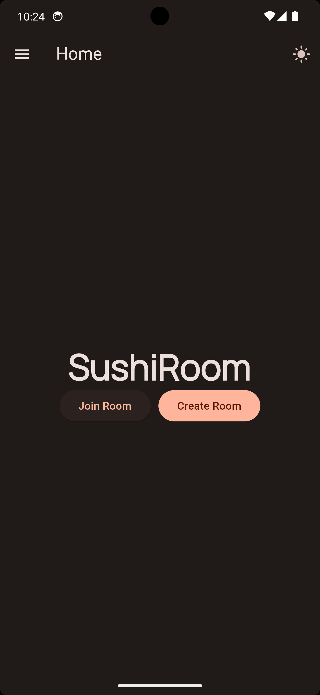
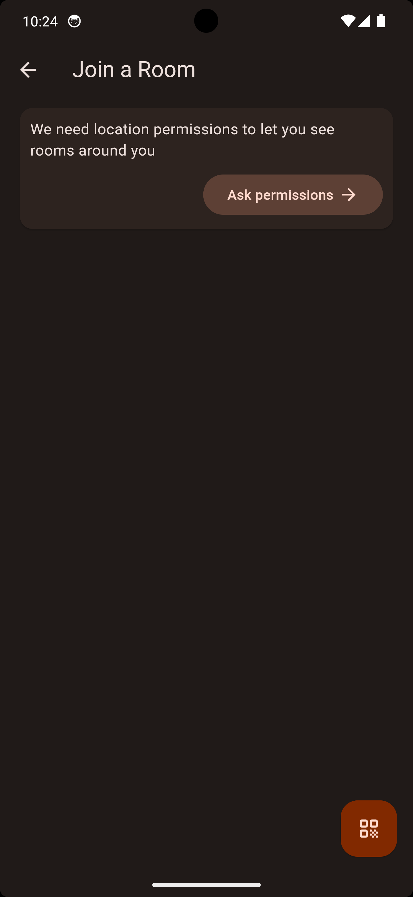
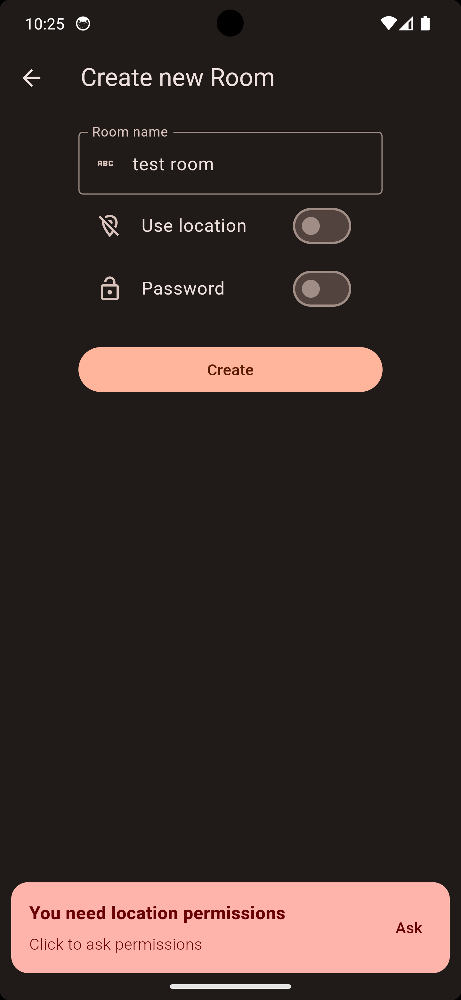
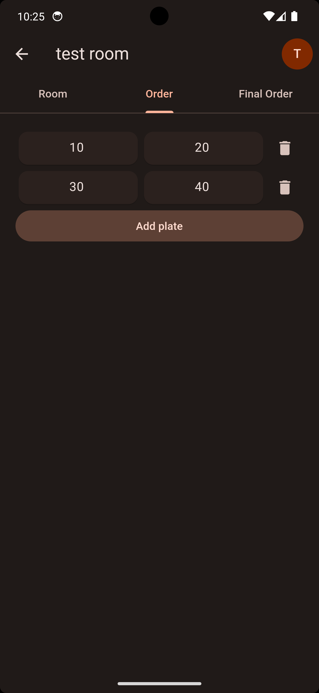
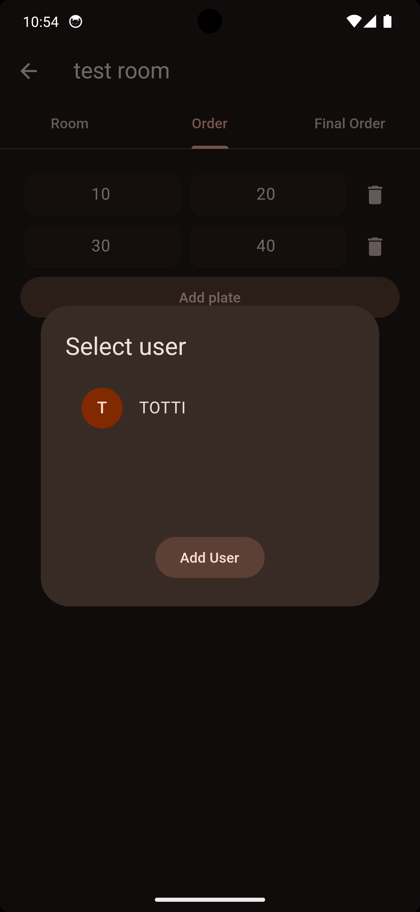
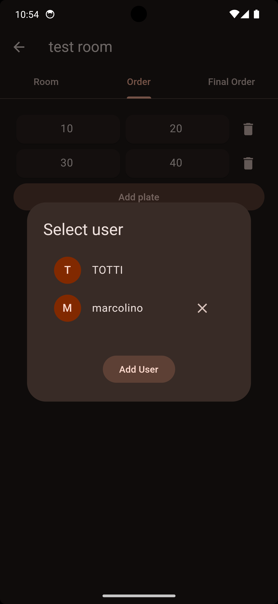
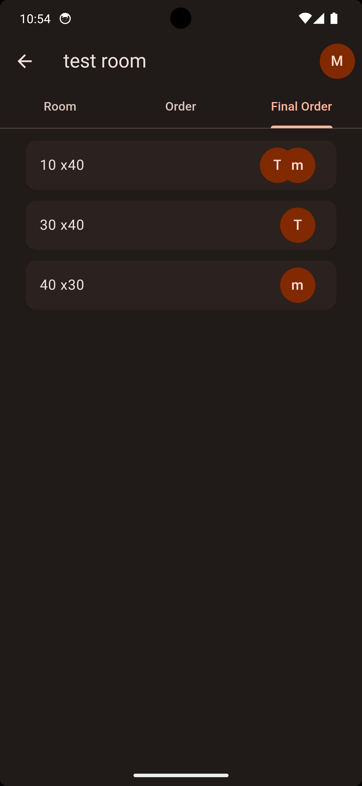
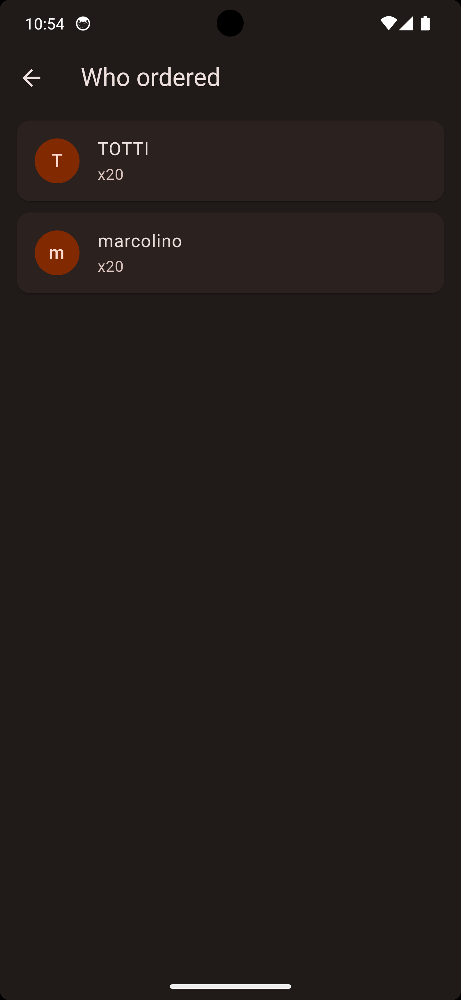

# SushiRoom


SushiRoom is a simple app made for ordering sushi easier. \
It takes your orders and then merge them into one order.

### You can watch a _very cool_ video demo [here](https://youtu.be/9jg8NkpziHs?si=x2oHx-JdfPrlWH1P).

# Screenshots

<details>
    <summary>Images</summary>
    
    
    
    
    
    
    
    
    
    

</details>

# Features

- ✅ Works on iOS and Android
- 📍 Join room by scanning QR code, room code or by finding rooms nearby you
- 🔒 Protect room with password
- 🕒 Realtime updates
- ❓ You can see who ordered what
- 👥 You can have multiple user on a single device
- 🎨 Material You design (dynamic colors, themed icon on A12+)

# Building from source

## Setting up firebase

1. Create a new firebase project (ignoring Android and iOS configuration)
2. Enable Anonymous authentication
3. Enable Firestore and setup rules for anonymous users
4. Install and config [flutterfire](https://firebase.google.com/docs/flutter/setup)

## Building

### Android

```
flutter build apk
```

Yeah `flutter pub get` isn't really necessary, since it gets executed by `flutter build apk` anyway.

### iOS

1. Connect your iPhone to your Mac
2. Open xcode and add a team account
3. Connect your iPhone to your Mac
4. Do some magic that will make app at least run (I'd write what to do, but it changes every time fr)

```
flutter run --release
```

By doing so you will have the app on your phone for free, without having to pay for an Apple Developer account, but it will only last for 7 days.
You will have to repeat the process every 7 days.

# Installing

Soon we will add releases.
